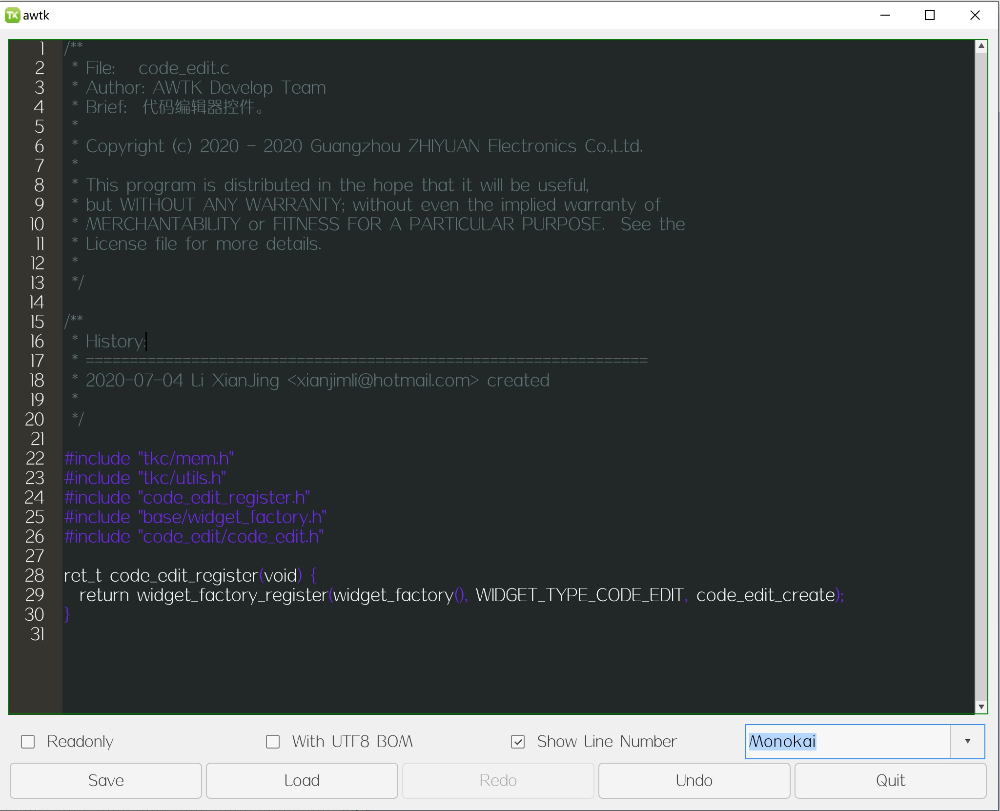

# awtk-widget-code-edit

基于 [scintilla](https://github.com/mirror/scintilla) 实现的代码编辑控件。



## 准备

1. 获取 awtk 并编译

```
git clone https://github.com/zlgopen/awtk.git
cd awtk; scons; cd -
```

## 运行

1. 生成示例代码的资源

```
python scripts/update_res.py all
```
> 也可以使用 Designer 打开项目，之后点击 “打包” 按钮进行生成
> 如果资源发生修改，则需要重新生成资源。

2. 编译

```
scons
```
> 注意：
> 编译前先确认 SConstruct 文件中的 awtk_root 是否为 awtk 所在目录，不是则修改。
> 默认使用动态库的形式，如果需要使用静态库，修改 SConstruct 文件中的 BUILD_SHARED = 'false' 即可。

3. 运行
```
./bin/demo
```

## 文档

* 基本用法

```xml
  <code_edit name="code" x="10" y="10" w="-20" h="-108" code_theme="stylers" filename="data/test.c">
   <scroll_bar_d name="vbar" x="right" y="0" w="14" h="100%" value="0"/>
  </code_edit>
```

* [AWTK 自定义控件规范](https://github.com/zlgopen/awtk/blob/master/docs/custom_widget_rules.md)
